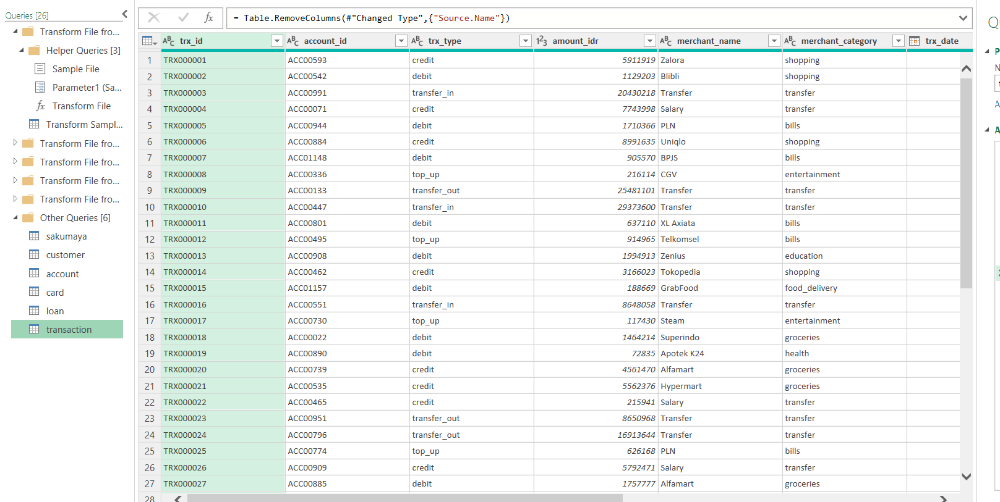
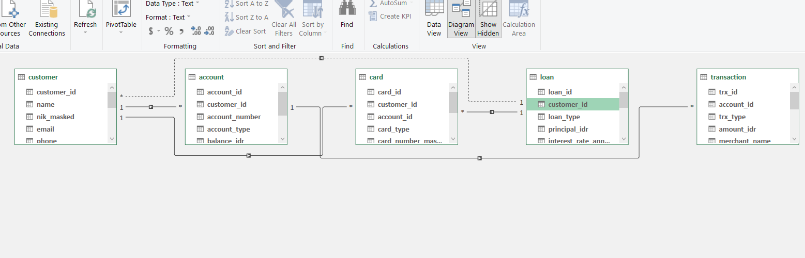
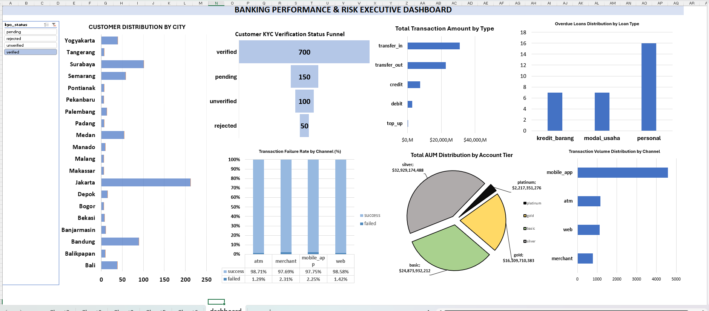

# 🏦 Executive Banking Analytics & Risk Management Dashboard 
 
An end-to-end banking analytics project developed using **Microsoft Excel** to transform relational banking data into an interactive executive dashboard. 
 
The project focuses on **customer demographics, KYC onboarding, transaction behavior, wealth management, operational performance, and credit risk** to provide a consolidated view of banking performance and risk exposure. 
 
--- 
 
## 📌 Project Overview 
 
This project simulates an executive-level banking analytics environment where decision-makers need to monitor customer activity, financial performance, operational reliability, and credit risk from multiple perspectives. 
 
The analysis covers four major areas: 
 
- 👥 Customer Demographics & KYC 
- 💳 Transaction Behavior & Channel Performance 
- 💰 Wealth Management & AUM 
- ⚠️ Operational Risk & Credit Risk 
 
The final output is an interactive Excel dashboard designed to present key metrics and business insights in a concise and decision-oriented format. 
 
---

## 📂 Dataset Source

The dataset used in this project was obtained from **Ngulik Data** and is based on the **Sakumaya banking dataset**.

🔗 [Sakumaya Banking Dataset — Ngulik Data](https://ngulikdata.com/datasets/sakumaya)

The dataset contains relational banking data used for analyzing customer profiles, accounts, transactions, loans, KYC status, and other banking-related activities.

--- 
 
## 🛠️ Tools & Skills Demonstrated 
 
### Microsoft Excel — Power Query & Power Pivot

- **Power Query — Data Preparation & Transformation**
  - Imported and consolidated data from multiple relational tables.
  - Performed data cleaning and transformation using Power Query.
  - Prepared structured datasets for downstream analysis and reporting.
  - Applied data type management, filtering, and transformation steps.
  - Built a reproducible data preparation workflow.
  

- **Power Pivot — Data Modeling & Analysis**
  - Built a relational data model connecting `customer`, `account`, `transaction`, and `loan` tables.
  - Defined relationships between tables using key fields.
  - Developed a centralized analytical data model for cross-table analysis.
  - Used PivotTables and PivotCharts on top of the Power Pivot data model.
  - Analyzed customer, transaction, AUM, and credit-risk metrics across multiple dimensions.

 

- **Interactive Dashboard Development**
  - Connected PivotTables and PivotCharts to the underlying data model.
  - Implemented interactive Slicers for filtering and exploration.
  - Designed KPI-driven dashboard components for executive reporting.
  - Applied custom number formatting and visual hierarchy for financial metrics.
 
### Data Visualization & Dashboard Design 
 
Purposeful chart selection was applied according to the analytical objective: 
 
| Visualization | Analytical Purpose | 
|---|---| 
| Horizontal Bar Chart | Customer distribution by geographical location | 
| Funnel Chart | KYC verification status | 
| 100% Stacked Column Chart | Transaction failure ratio | 
| Donut Chart | AUM composition by customer tier | 
| Vertical Column Chart | Overdue loans by loan type | 
 
Additional dashboard design practices included: 
 
- Hidden gridlines 
- Cleaned PivotChart field buttons 
- Hierarchical color palettes 
- Consistent typography 
- Custom currency formatting 
- Clear KPI hierarchy 
- Executive-oriented visual layout 
 
### Banking & Finance Domain Knowledge 
 
The project demonstrates analytical understanding of: 
 
- Customer segmentation 
- KYC monitoring 
- Wealth management 
- Assets Under Management (AUM) 
- Transaction channel performance 
- Operational risk 
- Credit risk 
- Overdue loans / NPL monitoring 
 
--- 
 
## 📊 Dashboard Preview 
 
 
 
--- 
 
## 📈 Key Business Insights 
 
### 👥 Geographical Concentration & KYC Onboarding 
 
- **Jakarta** significantly dominates the customer base compared with other regions. 
- The majority of customers have reached the `verified` status, with **700 verified accounts**. 
- Noticeable drop-offs remain across the `pending`, `unverified`, and `rejected` stages, indicating potential opportunities to improve the onboarding process. 
 
### 💳 Transactional Behavior & Channel Performance 
 
- `transfer_in` records the highest total transaction amount among the analyzed transaction types. 
- **`mobile_app`** is the primary customer touchpoint based on transaction volume. 
- Despite its high transaction volume, the `mobile_app` channel has a transaction failure ratio of approximately **2.25%**, while the `merchant` channel records approximately **2.31%**. 
- These failure ratios are slightly higher than those observed in physical ATM channels. 
 
### 💰 Wealth Distribution — AUM 
 
- Total Assets Under Management (AUM) is heavily concentrated in the **Silver** and **Basic** customer tiers. 
- The Silver tier holds approximately **$32.9B** in AUM. 
- The Basic tier holds approximately **$24.8B**. 
- The Platinum tier represents the smallest asset share at approximately **$2.2B**. 
 
### ⚠️ Credit Risk — Overdue Loans 
 
- **Personal loans** account for the highest number of overdue cases, with **16 instances**. 
- This is substantially higher than the overdue cases observed in business capital and merchandise credit categories. 
- The result indicates a concentration of overdue exposure within the personal loan segment. 
 
--- 
 
## 💡 Strategic Recommendations 
 
### 1. Optimize the KYC Onboarding Pipeline 
 
The operations team should investigate bottlenecks within the `pending` and `unverified` stages. 
 
Potential actions include: 
 
- Reducing verification processing time 
- Investigating common rejection reasons 
- Improving customer communication during verification 
- Monitoring conversion rates between KYC stages 
 
### 2. Enhance Digital Infrastructure 
 
The `mobile_app` is both the most frequently used transaction channel and a major contributor to absolute transaction failures. 
 
Therefore, improving digital infrastructure reliability should be prioritized to: 
 
- Reduce transaction failures 
- Improve customer experience 
- Maintain digital banking reliability 
- Monitor recurring system issues 
 
### 3. Tighten Credit Risk Assessment 
 
Since personal loans represent the largest share of overdue cases, risk management teams could consider more targeted credit assessment for consumer lending. 
 
Potential actions include: 
 
- Reviewing credit-scoring criteria 
- Identifying high-risk customer segments 
- Monitoring repayment behavior 
- Developing targeted early-warning indicators 
 
--- 
 
## 📋 Dashboard Coverage 
 
| Analytical Area | Key Metric / Analysis | 
|---|---| 
| Customer Demographics | Customer distribution by city | 
| KYC | Verification funnel | 
| Transactions | Transaction amount by type | 
| Channels | Transaction volume & failure rate | 
| Wealth Management | AUM by customer tier | 
| Credit Risk | Overdue loans by type | 
 
--- 

## 📌 Disclaimer

This project uses a publicly available dataset from **Ngulik Data** and is intended for educational and portfolio purposes. The analysis and recommendations presented in this project are based on the available dataset and do not represent the actual financial performance or risk profile of any real banking institution.
