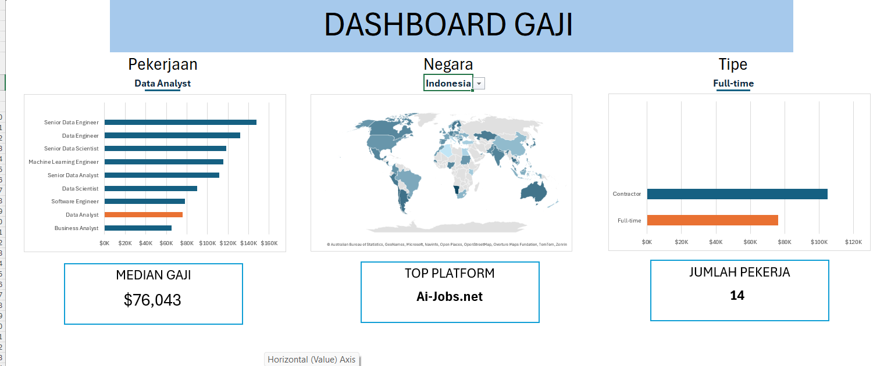

# 📊 Interactive Data Analyst Salary Dashboard

## 📌 Project Overview

This project is an interactive **Data Analyst Salary Dashboard** built entirely in **Microsoft Excel**.

The project analyzes a dataset containing **32,672 job postings** and focuses on salary analysis, job demand, employment type, job platforms, and geographic distribution.

The main objective is to transform raw job-posting data into an interactive analytical dashboard that allows users to dynamically explore:

- Median salary
- Number of job postings
- Job location
- Employment type
- Job posting platforms
- Salary by country
- Salary by job role

The dashboard is controlled through interactive selections for:

- **Job**
- **Country**
- **Employment Type**

The project demonstrates how advanced Excel formulas, structured references, dynamic arrays, named ranges, and dynamic charts can be combined to build an interactive analytical tool without relying on Power Query, Power Pivot, or DAX.

---

## 🎯 Project Objectives

The main objectives of this project are:

1. Analyze salary patterns across different Data Analyst roles.
2. Compare salaries across countries.
3. Analyze job postings based on employment type.
4. Identify the platforms used to publish job vacancies.
5. Dynamically calculate median salary based on user selections.
6. Dynamically calculate the number of relevant job postings.
7. Build an interactive Excel dashboard for exploratory analysis.
8. Demonstrate advanced Excel analytical skills using formulas and dynamic arrays.

---

## 📂 Dataset Overview

The dataset contains **32,672 job postings** with **16 variables**.

| Variable | Description |
|---|---|
| `job_title_short` | Short job title/category |
| `job_title` | Full job title |
| `job_location` | Job location |
| `job_via` | Job posting platform/source |
| `job_schedule_type` | Employment/schedule type |
| `job_work_from_home` | Work-from-home indicator |
| `job_country` | Country of the job |
| `salary_year_avg` | Average annual salary |
| `salary_hour_avg` | Average hourly salary |
| `company_name` | Company name |
| `job_posted_date` | Date the job was posted |

The dataset is stored in an Excel Table named `jobs`.

Using an Excel Table allows the analysis to use **structured references**, making formulas easier to read and automatically expandable when the dataset changes.

---

## 📚 Dataset Source

The dataset used in this project is sourced from **Luke Barousse's Excel for Data Analytics Course**, specifically the **Project 1 - Dashboard** materials.

- **Source Repository:** [Luke Barousse - Excel for Data Analytics Course](https://github.com/lukebarousse/Excel_Data_Analytics_Course)
- **Project 1 - Dashboard:** [Project_1-Dashboard](https://github.com/lukebarousse/Excel_Data_Analytics_Course/tree/main/Project_1-Dashboard)

The source repository provides the Excel files used for the course and includes a dedicated `Project_1-Dashboard` folder for the dashboard project. citeturn0search0

> **Credit:** Dataset and original course materials are attributed to **Luke Barousse**. This repository uses the dataset for learning, analysis, and portfolio purposes.

---

## 🛠️ Tools & Skills Demonstrated

### 📗 Microsoft Excel

Microsoft Excel is the primary tool used to clean, analyze, calculate, and visualize the job-posting dataset.

The project focuses on analytical Excel capabilities rather than traditional spreadsheet formatting.

### Excel Tables & Structured References

The dataset was converted into an Excel Table named:

`jobs`

This enables structured references such as:

`jobs[job_title_short]`  
`jobs[job_country]`  
`jobs[salary_year_avg]`  
`jobs[job_schedule_type]`  
`jobs[job_via]`

Structured references make formulas easier to understand and maintain compared with traditional cell references.

### 🔢 Advanced Excel Formula Analysis

Several Excel functions were used to perform dynamic calculations and filtering.

Main functions include:

- `MEDIAN`
- `IF`
- `SEARCH`
- `ISNUMBER`
- `COUNT`
- `COUNTIFS`
- `XLOOKUP`
- `UNIQUE`
- `FILTER`
- `SORT`
- `SUBSTITUTE`
- `NA`

These functions were combined to create multi-condition salary calculations, platform analysis, dynamic lists, and dashboard interactions.

### 🔎 Multi-Criteria Analysis

The dashboard uses multiple criteria simultaneously.

For example, median salary is calculated based on:

- Selected job
- Selected country
- Selected employment type
- Available annual salary values

Example formula:

`=MEDIAN(IF((jobs[job_title_short]=A2)*(jobs[salary_year_avg]<>0)*(jobs[job_country]=Negara)*(ISNUMBER(SEARCH(Tipe,jobs[job_schedule_type]))),jobs[salary_year_avg]))`

This formula demonstrates how multiple logical conditions can be combined inside an Excel calculation.

### 📊 Dynamic Array Analysis

Dynamic array functions were used to generate analytical lists automatically.

Functions used include:

- `UNIQUE`
- `FILTER`
- `SORT`

For example, platform data can be filtered and sorted dynamically using:

`=SORT(FILTER(A2:B594,B2:B594),2,-1)`

This allows the dashboard analysis to update automatically based on the selected criteria.

### 🌍 Geographic Salary Analysis

The dashboard allows salary analysis to be filtered by country.

The selected country is stored through a named range:

`Negara`

This value is then referenced by analytical formulas to dynamically calculate salary and job-posting metrics.

### 💼 Job Posting Analysis

The project analyzes job demand using the number of relevant job postings.

The dashboard can dynamically count postings based on:

- Job title
- Country
- Employment type
- Job platform

Example:

`=COUNTIFS(jobs[job_title_short],Pekerjaan,jobs[job_country],Negara,jobs[job_via],A2,jobs[job_schedule_type],Tipe)`

This allows the dashboard to determine how many job postings match the selected criteria.

### 🌐 Job Platform Analysis

The project analyzes the platforms where job vacancies are posted.

The analysis identifies platforms with the highest number of relevant job postings.

The platform name can also be cleaned using:

`=SUBSTITUTE(C2,"via ","")`

This removes the `"via "` prefix from platform labels.

### 🔗 XLOOKUP

`XLOOKUP` is used to retrieve analytical values dynamically.

Example:

`=XLOOKUP(Pekerjaan,C2:C11,D2:D11)`

This allows the dashboard to return the value associated with the selected job.

### 🏷️ Named Ranges

Named ranges were used to make dashboard formulas easier to read and maintain.

The main named ranges include:

- `Pekerjaan`
- `Negara`
- `Tipe`
- `median_gaji`
- `Jumah_pekerja`
- `link`

These names connect dashboard controls with the underlying calculations.

### 🎛️ Interactive Dashboard Controls

The dashboard contains interactive controls that allow users to change:

- **Job**
- **Country**
- **Employment Type**

Changing these selections automatically updates the analytical outputs.

This creates an interactive exploration experience rather than a static report.

### 📈 Dynamic Chart Highlighting

The dashboard uses formulas to dynamically highlight the selected category in charts.

Example:

`=IF($C2=Pekerjaan,$D2,NA())`

and:

`=IF($C2<>Pekerjaan,$D2,NA())`

Using `NA()` prevents non-selected values from being plotted in the highlighted chart series.

This technique creates a dynamic visual emphasis based on the user's selection.

---

## 🎨 Dashboard Design

The dashboard was designed around three primary user selections:

### 1. Job

Users can select the job category they want to analyze.

### 2. Country

Users can select the country where the job is located.

### 3. Employment Type

Users can select the relevant employment/schedule type.

Based on these selections, the dashboard dynamically updates its analytical outputs.

---

## 📊 Dashboard Metrics

The dashboard focuses on several key metrics.

### Median Salary

The dashboard calculates the median annual salary for the selected:

- Job
- Country
- Employment type

Median was chosen because it is less affected by extreme salary values than the average.

### Job Postings

The dashboard calculates the number of job postings matching the selected criteria.

This provides an indication of job demand within the selected segment.

### Top Job Platform

The platform analysis identifies which job-posting platform has the highest number of relevant vacancies.

This provides additional context regarding where jobs are being advertised.

---

## 🔄 Analytical Workflow

The overall workflow of the project is:

**Raw Job Posting Dataset**  
↓  
**Excel Table**  
↓  
**Structured References**  
↓  
**Dynamic Filtering**  
↓  
**Multi-Criteria Analysis**  
↓  
**Salary & Job Posting Calculations**  
↓  
**Platform Analysis**  
↓  
**XLOOKUP / Dynamic Arrays**  
↓  
**Interactive Dashboard**

---

## 🧮 Excel Functions Used

| Function | Purpose |
|---|---|
| `MEDIAN` | Calculate median salary |
| `IF` | Apply conditional logic |
| `SEARCH` | Search for employment type text |
| `ISNUMBER` | Validate search results |
| `COUNT` | Count numerical values |
| `COUNTIFS` | Count job postings using multiple criteria |
| `XLOOKUP` | Retrieve matching analytical values |
| `UNIQUE` | Generate unique values |
| `FILTER` | Filter analytical datasets |
| `SORT` | Sort analytical results |
| `SUBSTITUTE` | Clean platform text |
| `NA` | Exclude values from chart plotting |

---

## 🧠 Excel Skills Demonstrated

This project demonstrates practical skills in:

- Excel Table creation
- Structured references
- Advanced Excel formulas
- Multi-condition calculations
- Dynamic arrays
- Dynamic filtering
- Conditional logic
- Text searching
- Data cleaning with formulas
- Salary analysis
- Job demand analysis
- Geographic analysis
- Job platform analysis
- XLOOKUP
- Named ranges
- Interactive dashboard design
- Dynamic chart highlighting
- Data visualization

---

## 📌 Key Analytical Insights

Using the dashboard's default selections, the analysis produces example outputs such as:

| Metric | Example Result |
|---|---:|
| Median Salary | ~$76,043 |
| Top Platform | Ai-Jobs.net |
| Job Postings | 14 |

> **Note:** These values depend on the selected Job, Country, and Employment Type filters in the dashboard.

The dashboard is designed so that these values update dynamically when the user changes the selections.

---

## 💡 Business & Analytical Value

This project demonstrates how job-market data can be transformed into actionable information.

The dashboard can help users:

- Understand salary levels for specific roles.
- Compare salary conditions across countries.
- Identify the demand for specific job categories.
- Understand employment-type patterns.
- Identify major job-posting platforms.
- Explore job-market information interactively.

For a data analyst portfolio, the project demonstrates not only spreadsheet knowledge but also the ability to structure an analytical problem and convert raw data into an interactive reporting solution.

---

## 📊 Final Interactive Dashboard

The final dashboard combines:

- Interactive filters
- KPI-style metrics
- Salary analysis
- Job-posting counts
- Platform analysis
- Dynamic charts
- Named ranges
- Formula-driven calculations

The dashboard is designed to allow users to explore the dataset without manually changing formulas.
---

## 🚀 What This Project Demonstrates

This project demonstrates the ability to:

1. Work with a large job-posting dataset.
2. Structure raw data using Excel Tables.
3. Use structured references in analytical formulas.
4. Perform multi-criteria analysis.
5. Calculate median salary dynamically.
6. Analyze job-posting volume.
7. Analyze job-posting platforms.
8. Use dynamic array formulas.
9. Use XLOOKUP for dynamic retrieval.
10. Use named ranges to connect dashboard controls with calculations.
11. Build dynamic charts.
12. Create an interactive Excel dashboard.
13. Present analytical results in a clear and user-friendly format.

---

## 🎯 Project Objective

The ultimate goal of this project is to demonstrate how **Microsoft Excel can be used as an analytical tool for real-world job-market data**.

Rather than creating a static spreadsheet, the project transforms the dataset into an interactive dashboard where users can dynamically explore salary and job-market information based on their selected criteria.

---

## 📝 Notes

This project intentionally focuses on advanced Excel formulas, dynamic analysis, and interactive dashboard development.

The analysis does **not** rely on:

- Power Query
- Power Pivot
- DAX

Instead, the project demonstrates how far analytical workflows can be developed using standard and advanced Excel functions, structured references, named ranges, dynamic arrays, and chart techniques.

---

## 📚 Skills Summary

**Tools**

- Microsoft Excel

**Technical Skills**

- Data Analysis
- Data Cleaning
- Data Filtering
- Multi-Criteria Analysis
- Dynamic Array Analysis
- Salary Analysis
- Job Market Analysis
- Geographic Analysis
- Dashboard Development
- Data Visualization

**Excel Functions**

- MEDIAN
- IF
- SEARCH
- ISNUMBER
- COUNT
- COUNTIFS
- XLOOKUP
- UNIQUE
- FILTER
- SORT
- SUBSTITUTE
- NA

**Excel Features**

- Excel Tables
- Structured References
- Named Ranges
- Dynamic Arrays
- Interactive Controls
- Dynamic Charts

---

## ⭐ Conclusion

This project showcases an end-to-end Excel analytics workflow, starting from a large job-posting dataset and transforming it into an interactive salary and job-market dashboard.

It demonstrates practical Excel skills in:

- Data analysis
- Formula engineering
- Dynamic filtering
- Salary analysis
- Job-market analysis
- Dashboard development
- Data visualization

The result is an interactive analytical tool that allows users to explore job-market data dynamically based on **Job, Country, and Employment Type** selections.
