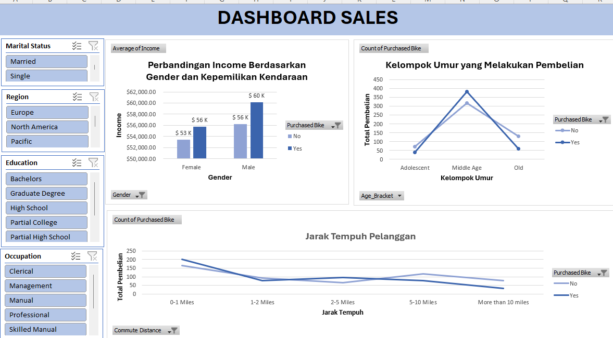

# 🚲 Bike Purchase Analysis Dashboard — Excel



An interactive **Microsoft Excel dashboard** designed to analyze customer bicycle purchasing behavior based on demographic, income, occupation, education, and commuting-distance data.

This project demonstrates how **Excel PivotTables, PivotCharts, Slicers, calculated columns, and dashboard design** can be used to transform raw customer data into meaningful business insights.

---

## 📊 Project Overview

The dataset contains information from **1,000 customers** with attributes including:

* Customer ID
* Marital Status
* Gender
* Income
* Children
* Education
* Occupation
* Home Ownership
* Number of Cars
* Commute Distance
* Region
* Age
* Age Bracket
* Purchased Bike

### 🎯 Project Objective

The main objective is to explore customer characteristics and identify patterns associated with **bicycle purchasing behavior**.

---

## 🎯 Business Questions

This dashboard is designed to answer questions such as:

* Which age group is more likely to purchase a bike?
* How does average income differ between bike purchasers and non-purchasers?
* Is commute distance associated with bike purchasing behavior?
* How do demographic characteristics relate to purchasing decisions?
* How does customer behavior change when different customer segments are selected?

---

## 🛠️ Tools & Excel Skills

**Microsoft Excel**

* PivotTables
* PivotCharts
* Slicers
* IF / Nested IF formulas
* Calculated columns
* Data categorization
* Data aggregation
* Customer segmentation
* Data visualization
* Interactive dashboard design
* Business-oriented data analysis

---

## 🗂️ Workbook Structure

The workbook consists of three main sheets:

### 1. `bike_buyers`

Contains the raw customer dataset with approximately **1,000 customer records**.

### 2. `Sheet1`

Contains the analysis layer, including PivotTables used as the data source for the dashboard visualizations.

### 3. `Dashboard`

Contains the interactive dashboard, charts, and slicers used to explore customer purchasing behavior.

### 🔄 Data Workflow

```text
Raw Data
    ↓
Calculated Columns
    ↓
PivotTables
    ↓
PivotCharts
    ↓
Slicers
    ↓
Interactive Dashboard
    ↓
Business Insights
```

---

## 📈 Dashboard Analysis

The dashboard contains three primary visualizations.

### 1. Average Income by Gender & Bike Purchase

This visualization compares the average income of customers who purchased a bike with customers who did not, segmented by gender.

| Gender | Did Not Purchase | Purchased |
| ------ | ---------------: | --------: |
| Female |          ~$53.4K |   ~$55.8K |
| Male   |          ~$56.2K |   ~$60.1K |

The visualization indicates that customers who purchased bikes have slightly higher average income than non-purchasers for both genders.

---

### 2. Bike Purchases by Age Bracket

Customers are categorized into three age groups:

* **Adolescent:** Under 31
* **Middle Age:** 31–54
* **Old:** 55+

The analysis shows that the **Middle Age** segment represents the largest customer group and has a strong purchasing rate within the dataset.

---

### 3. Bike Purchases by Commute Distance

Bike purchasing behavior is analyzed across five commute-distance categories:

* 0–1 Miles
* 1–2 Miles
* 2–5 Miles
* 5–10 Miles
* More than 10 Miles

Customers commuting **2–5 miles** have the highest purchase rate, while customers commuting more than 10 miles have the lowest purchase rate.

---

## 🎛️ Interactive Filters

The dashboard includes four interactive slicers:

* **Marital Status**
* **Region**
* **Education**
* **Occupation**

These slicers allow users to dynamically explore different customer segments and observe how the dashboard metrics and visualizations change.

---

## 🔍 Key Insights

### 1. Middle-aged customers are the strongest purchasing segment

The **Middle Age** group accounts for the largest number of customers and has an estimated purchase rate of approximately **54.6%**.

This suggests that middle-aged customers may represent an important target segment for bicycle-related marketing campaigns.

---

### 2. Commute distance shows an interesting pattern

The estimated purchase rates by commute distance are:

| Commute Distance   | Purchase Rate |
| ------------------ | ------------: |
| 0–1 Miles          |         54.6% |
| 1–2 Miles          |         45.6% |
| 2–5 Miles          |     **58.6%** |
| 5–10 Miles         |         39.6% |
| More than 10 Miles |         29.7% |

Customers with a **2–5 mile commute** have the highest bike purchase rate in the dataset.

Interestingly, the purchase rate decreases considerably among customers commuting more than 5 miles.

---

### 3. Bike purchasers have slightly higher average income

Both male and female customers who purchased bikes show higher average income compared with non-purchasers.

This indicates an **association between income and bike purchasing behavior** within the dataset.

However, this relationship should not be interpreted as a causal relationship.

---

## 💡 Project Takeaways

This project demonstrates a complete Excel-based data analysis workflow:

```text
Data Preparation
       ↓
Data Categorization
       ↓
Data Aggregation
       ↓
Exploratory Analysis
       ↓
Data Visualization
       ↓
Interactive Dashboard
       ↓
Business Insights
```

Through this project, I strengthened my practical skills in:

* Excel data analysis
* PivotTable-based analysis
* Interactive dashboard development
* Customer segmentation
* Data visualization
* Data categorization
* Business-oriented interpretation
* Presenting analytical findings

---

## 📁 Project Source

The dataset and project concept are based on the Excel project dataset provided by **Alex The Analyst**.

---

## 👤 Author

**[Zata Maitsaa Syahada]**

Aspiring Data Analyst | Excel | SQL | Power BI | Data Analytics

---

## ⭐ Project Feedback

If you find this project useful, feel free to explore the workbook and dashboard.

If you have suggestions for improving the analysis or dashboard, feedback is always welcome.
